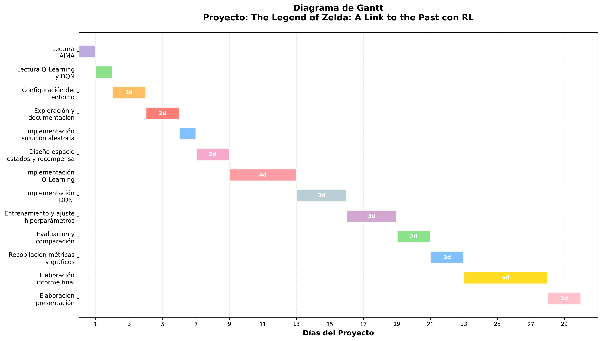

# Anteproyecto Final con IA

## The Legend of The Zelda: A Link to the Past with Reinforcement Learning

**Código del Proyecto:** LINK

**Integrantes:** Juan Ignacio Massacesi , Lautaro Larosa

---

## Descripción del Proyecto

El proyecto consistirá en resolver la batalla final contra Ganon en The Legend of Zelda: A Link to the Past utilizando Reinforcement Learning. Este enfrentamiento es uno de los más icónicos de la franquicia, donde el jugador debe combatir contra Ganon en un entorno dinámico que requiere esquivar ataques, gestionar el tiempo de vulnerabilidad del enemigo y realizar ataques estratégicos. El desafío incluye múltiples fases de combate con patrones de ataque variables, donde el agente debe aprender a sobrevivir el mayor tiempo posible, infligir daño efectivo y finalmente derrotar al jefe final.

## Objetivos del Proyecto

El objetivo del proyecto es utilizar diversos algoritmos del área de Reinforcement Learning para intentar lograr que el agente aprenda a enfrentar la batalla de la mejor manera posible. El alcance del proyecto estará limitado a aplicar ciertos algoritmos para comparar las diversas métricas entre sí, estos serían: la solución aleatoria (baseline), Q-Learning, y DQN (Deep Q Network). Se busca analizar cómo cada enfoque aprende a maximizar el daño infligido a Ganon mientras minimiza el daño recibido, adaptándose a los patrones de ataque del enemigo.

## Métricas 

La batalla contra Ganon tiene múltiples objetivos que permiten evaluar el desempeño del agente. Las métricas a considerar serán:

- **Victoria/Derrota**: Indicador binario de si el agente logró derrotar a Ganon, junto con la tasa de éxito en un número determinado de intentos.
- **Tiempo de supervivencia**: Cantidad de frames o segundos que el agente permaneció vivo durante la batalla.
- **Daño infligido a Ganon**: Porcentaje de vida reducida al jefe final durante el combate.
- **Daño recibido**: Cantidad de vida perdida por el agente durante el enfrentamiento.
- **Eficiencia de combate**: Ratio entre daño infligido y daño recibido.
- **Tiempo hasta la victoria**: En caso de ganar, cuánto tiempo tardó en derrotar a Ganon.
- **Métrica compuesta**: Combinación ponderada de las métricas anteriores que considere supervivencia, efectividad en el ataque y eficiencia general.

## Herramientas a utilizar

Para la realización del proyecto se utilizarán las siguientes herramientas:

- **Stable Retro**: Versión mantenida por la comunidad de Gym Retro que permite interactuar con The Legend of Zelda: A Link to the Past como un entorno de Reinforcement Learning. Proporciona acceso a la RAM del juego, permitiendo observar estados (vida de Link, vida de Ganon, posición, etc.) y enviar acciones (movimiento, ataque, etc.). Se utiliza esta versión ya que Gym Retro original de OpenAI ya no recibe mantenimiento activo.
- **Python 3.x**: Lenguaje de programación principal para la implementación.
- **Stable Baselines3** (opcional): Librería de Python con implementaciones optimizadas de algoritmos de RL, útil para DQN si se implementa.
- **NumPy y Pandas**: Para procesamiento de datos y cálculo de métricas.
- **Matplotlib/Seaborn**: Para visualización y graficación de resultados.
- **OpenCV** (opcional): Para procesamiento de frames si se requiere extracción de características visuales.
- **TensorFlow o PyTorch** : Frameworks de aprendizaje profundo.

## Justificación

El aprendizaje por refuerzo ofrece un enfoque adecuado para abordar la batalla final contra Ganon en The Legend of Zelda: A Link to the Past, ya que permite al agente aprender estrategias óptimas a partir de la interacción directa con el entorno, sin requerir conocimiento previo o reglas explícitas. Mediante la maximización de recompensas, el agente puede desarollar comportamientos que le van a permitir mejorar su desempeño.
Los algoritmos de aprendizaje por refuerzo presentan la capacidad de adaptarse a patrones dinámicos, lo que resulta esencial en una pelea donde los ataques y movimientos del enemigo varían constantemente. Además, este enfoque posibilita la toma de decisiones en tiempo real, permitiendo que el agente determine de manera eficiente cuándo atacar, esquivar o utilizar ítems según la situación.

## Experimentos

Se implementará una estrategia de entrenamiento progresivo con evaluaciones independientes, separando claramente las fases de entrenamiento y evaluación.

### Metodología de Entrenamiento y Evaluación

Para cada algoritmo Q-Learning y DQN, se seguirá el siguiente protocolo experimental:

**Fase 1 - Entrenamiento inicial (1000 episodios):**
- Entrenar el agente durante 1000 episodios en la batalla contra Ganon
- Guardar el modelo entrenado resultante
- Evaluar este modelo en 100 episodios de prueba independientes
- Registrar todas las métricas de desempeño

**Fase 2 - Entrenamiento extendido (2000 episodios):**
- Entrenar el agente durante 2000 episodios en la batalla contra Ganon
- Guardar el modelo entrenado resultante
- Evaluar este modelo en 100 episodios de prueba independientes
- Registrar todas las métricas de desempeño

**Fase 3 - Entrenamiento completo (3000 episodios):**
- Entrenar el agente durante 3000 episodios en la batalla contra Ganon
- Guardar el modelo entrenado resultante
- Evaluar este modelo en 100 episodios de prueba independientes
- Registrar todas las métricas de desempeño

Esta estrategia permitirá:
- Observar la curva de aprendizaje de cada algoritmo a medida que aumentan los episodios de entrenamiento
- Identificar si existe convergencia en el aprendizaje y en qué punto ocurre
- Determinar el número óptimo de episodios de entrenamiento necesarios para cada enfoque
- Detectar posibles casos de sobreajuste (overfitting) si el desempeño disminuye con más entrenamiento
- Realizar comparaciones justas entre algoritmos utilizando los mismos 100 episodios de evaluación en cada fase

Los 100 episodios de evaluación se mantendrán consistentes y separados del conjunto de entrenamiento para todas las fases y algoritmos, garantizando una evaluación imparcial del desempeño aprendido.

## Listado de Actividades a Realizar

1. Lectura del capítulo 21 (Reinforcement Learning) del AIMA [1 día]
2. Lectura de documentación sobre Q-Learning y DQN [1 día]
3. Configuración del entorno de desarrollo (Gym Retro + ROM de Zelda) [2 días]
4. Exploración y documentación del entorno de juego (estados, acciones, recompensas) [2 días]
5. Implementación de la solución aleatoria (baseline) [1 día]
6. Diseño del espacio de estados y función de recompensa [2 días]
7. Implementación de Q-Learning para la batalla contra Ganon [4 días]
8. Implementación de DQN  [3 días]
9. Entrenamiento y ajuste de hiperparámetros de los modelos [3 días]
10. Evaluación y comparación de las soluciones implementadas [2 días]
11. Recopilación de métricas y generación de gráficos comparativos [2 días]
12. Elaboración del informe final [5 días]
13. Elaboración de la presentación [2 días]

**Total estimado**: 30 días (incluyendo Q-Learning, Random y DQN)

---

## Diagrama gantt

## Bibliografía

- Russell, S., & Norvig, P. (2020). *Artificial Intelligence: A Modern Approach* (4th Edition). Capítulo 21: Reinforcement Learning. Pearson.
  - http://aima.cs.berkeley.edu/

- Stable Retro - GitHub Repository
  - https://github.com/Farama-Foundation/stable-retro

- Stable Retro Official Website
  - https://stable-retro.farama.org/

- Stable Baselines3 - Documentation
  - https://stable-baselines3.readthedocs.io/

- Sutton, R. S., & Barto, A. G. (2018). *Reinforcement Learning: An Introduction* (2nd Edition). MIT Press.
  - http://incompleteideas.net/book/the-book-2nd.html

- Nintendo. *The Legend of Zelda: A Link to the Past* - Zelda Wiki
  - https://zelda.fandom.com/wiki/The_Legend_of_Zelda:_A_Link_to_the_Past

