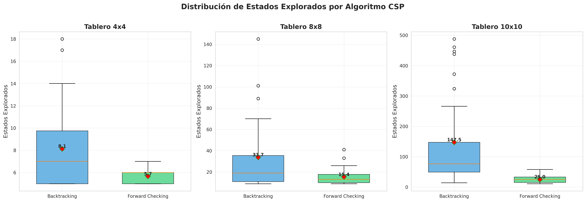

# Trabajo Práctico 5: Satisfacción de Restricciones

## Parte Teórica

### 1. Formulación CSP para Sudoku

#### Definición del problema

El Sudoku es un problema de satisfacción de restricciones donde se debe llenar un tablero de 9×9 con dígitos del 1 al 9, cumpliendo ciertas restricciones.

#### Variables

- **Variables**: 81 variables, una por cada celda de la grilla
  - Representación: `X_{ij}` donde `i` es la fila (0-8) y `j` es la columna (0-8)

#### Dominios

- **Dominio inicial**: Para cada variable `X_{ij}`:
  - Si la celda está vacía: `D_{ij} = {1, 2, 3, 4, 5, 6, 7, 8, 9}`
  - Si la celda tiene un valor dado: `D_{ij} = {valor_dado}`

#### Restricciones

El Sudoku tiene tres tipos de restricciones:

1. **Restricción de fila**: Para cada fila `i` (0-8):
   - `X_{i0}, X_{i1}, X_{i2}, ..., X_{i8}`
   - Todos los valores en la misma fila deben ser diferentes

2. **Restricción de columna**: Para cada columna `j` (0-8):
   - `X_{0j}, X_{1j}, X_{2j}, ..., X_{8j}`
   - Todos los valores en la misma columna deben ser diferentes

3. **Restricción de subcuadrícula 3×3**: Para cada uno de los 9 bloques:
   - Los 9 valores en cada bloque deben ser diferentes.
   - Ejemplo: bloque superior izquierdo incluye `X_{00}, X_{01}, X_{02}, X_{10}, X_{11}, X_{12}, X_{20}, X_{21}, X_{22}`


---

### 2. AC-3 para detectar inconsistencia en el mapa de Australia

#### Problema: Colorear el mapa de Australia

**Variables**: 
- WA, NT, SA, Q, NSW, V, T

**Restricciones** (regiones adyacentes deben tener colores diferentes):
- WA ≠ NT
- WA ≠ SA
- NT ≠ SA
- NT ≠ Q
- SA ≠ Q
- SA ≠ NSW
- SA ≠ V
- Q ≠ NSW
- NSW ≠ V

#### Ejecución del algoritmo AC-3

**Cola inicial de arcos**:

La cola de AC-3 comienza con **todos** los arcos `(X, Y)` para cada restricción `X ≠ Y`.

---

### Inicialización de dominios

**Dominios iniciales** (después de asignaciones WA=red, V=blue):

```
D(WA)  = {red}
D(V)   = {blue}
D(NT)  = {red, green, blue}
D(SA)  = {red, green, blue}
D(Q)   = {red, green, blue}
D(NSW) = {red, green, blue}
D(T)   = {red, green, blue}  (Tasmania no tiene restricciones)
```
---

### Propagación (revisiones clave)

#### 1) Efecto de WA = red

- **Revisar (NT, WA)**: como WA solo permite `red`, eliminamos de D(NT) el valor **red** 
  → `D(NT) = {green, blue}`

- **Revisar (SA, WA)**: quitamos **red** de D(SA) 
  → `D(SA) = {green, blue}`

#### 2) Efecto de V = blue

- **Revisar (SA, V)**: quitamos **blue** de D(SA) 
  → `D(SA) = {green}` (dominio unitario)

- **Revisar (NSW, V)**: quitamos **blue** de D(NSW) 
  → `D(NSW) = {red, green}`

Al volverse unitario SA, AC-3 vuelve a **encolar** arcos `(Z, SA)` para todos los vecinos Z ∈ {WA, NT, Q, NSW, V}.

#### 3) Propagar SA = green

- **(NT, SA)**: eliminar **green** de D(NT) 
  → `D(NT) = {blue}` (dominio unitario)

- **(Q, SA)**: eliminar **green** de D(Q) 
  → `D(Q) = {red, blue}`

- **(NSW, SA)**: eliminar **green** de D(NSW) 
  → `D(NSW) = {red}` (dominio unitario)

- **(WA, SA)** y **(V, SA)** no cambian (ya unitarios y distintos de green)

Al volverse unitario NT y NSW, re-encolamos `(Z, NT)` y `(Z, NSW)` para sus vecinos.

#### 4) Propagar NT = blue

- **(Q, NT)**: eliminar **blue** de D(Q) 
  → `D(Q) = {red}` (dominio unitario)

- **(WA, NT)** y **(SA, NT)** no cambian (ya distintos)

Al volverse unitario Q, AC-3 encola `(Z, Q)` para sus vecinos NT, SA, NSW.

#### 5) Propagar Q = red

- **(NSW, Q)**: eliminar **red** de D(NSW). Pero `D(NSW) = {red}` 
  → **se vacía**: `D(NSW) = ∅`

Si **algún dominio queda vacío**, AC-3 detecta **inconsistencia**.

---

#### Conclusión

**Resultado**: AC-3 retorna `False`, indicando que la asignación parcial `WA=red, V=blue` es **inconsistente** y no puede extenderse a una solución completa del problema.

---

### 3. Complejidad de AC-3 en CSP con estructura de árbol

#### Pregunta

¿Cuál es la complejidad en el peor caso cuando se ejecuta AC-3 en un árbol estructurado CSP? (i.e. cuando el grafo de restricciones forma un árbol: cualesquiera dos variables están relacionadas por a lo sumo un camino).

#### Respuesta

**Complejidad**: **O(n·d²)** donde:
- `n` = número de variables
- `d` = tamaño del dominio (asumiendo que todos los dominios tienen el mismo tamaño)

#### Demostración

**1) Estructura de árbol - Propiedades importantes**:

En un CSP estructurado como árbol:
- Hay exactamente **n - 1** arcos (restricciones) entre n variables
- No hay ciclos
- Existe un único camino entre cualquier par de variables

**2) Análisis del algoritmo AC-3**:

Para cada arco `(X, Y)`:
- Revisar el arco significa verificar cada valor `x ∈ D(X)` contra cada valor `y ∈ D(Y)`
- Costo de revisar un arco: **O(d²)** operaciones

**3) Cálculo final**:

```
Complejidad total = (número de revisiones) × (costo por revisión)
                  = O(n) × O(d²)
                  = O(n·d²)
```


---

## Parte Experimental

### 4. Implementación de algoritmos CSP para N-Reinas

#### 4.1 Backtracking

Algoritmo básico de búsqueda en profundidad con retroceso que:
- Asigna variables (columnas) en orden
- Verifica restricciones al momento de asignar
- Retrocede cuando encuentra conflicto

#### 4.2 Forward Checking

Extensión del backtracking que incorpora propagación de restricciones:
- Al asignar una variable, actualiza dominios de variables futuras
- Elimina valores inconsistentes de forma anticipada
- Usa heurística **MRV (Minimum Remaining Values)** para selección de variable

---

### 5. Diseño Experimental

- **Tamaños de tablero**: 4×4, 8×8, 10×10
- **Repeticiones**: 30 ejecuciones por algoritmo y tamaño (diferentes semillas)
- **Algoritmos evaluados**: Backtracking, Forward Checking
- **Métricas**:
  - Porcentaje de éxito
  - Nodos explorados (media y desviación estándar)
  - Tiempo de ejecución (media y desviación estándar)

---

### 6. Resultados

#### 6.1 Porcentaje de Éxito

Ambos algoritmos encontraron solución válida en **todas las ejecuciones**.

---

#### 6.2 Nodos Explorados




**Observaciones principales**:

1. **En tableros pequeños (4×4)**: Ambos algoritmos se comportan de forma similar. Backtracking explora entre 5 y 18 nodos, mientras que FC explora entre 5 y 7 nodos.

2. **En tableros medianos (8×8)**: Backtracking muestra una caja mucho más alta y con varios outliers, es decir, en algunos casos tuvo que explorar más de 100 nodos. FC mantiene una exploración más controlada, siempre por debajo de 40 nodos.

3. **En tableros grandes (10×10)**: Backtracking explora desde 20 hasta más de 500 nodos, mientras que FC raramente supera los 50 nodos.

---

#### 6.3 Tiempo de Ejecución


**Observaciones principales**:

1. **En tableros pequeños (4×4)**: FC es más lento que Backtracking. Porque el tiempo que FC gasta actualizando dominios y verificando restricciones no se compensa.

2. **En tableros medianos (8×8)**: Backtracking empieza a sufrir porque explora más nodos, mientras que el overhead de FC comienza a valer la pena. 

3. **En tableros grandes (10×10)**: Backtracking puede tardar hasta 2 milisegundos en casos difíciles, FC raramente supera 0.5 milisegundos. La mediana de FC está alrededor de 0.25 ms, mientras que BT está en 0.5 ms.

---

### 7. Comparación con Búsquedas Locales (TP4)

La diferencia de los algoritmos radica en el enfoque, las busquedas locales parten de una configuración completa y la mejoran iterativamente (pudiendo quedar atrapadas en mínimos locales), los algoritmos CSP construyen la solución paso a paso respetando restricciones desde el inicio, garantizando encontrar una solución si existe. Esta diferencia se refleja en que Backtracking y FC lograron 100% de éxito en todos los tamaños de tablero.

En términos de eficiencia, FC resulta ser el algoritmo más efectivo de ambos trabajos prácticos, ya que explora menos estados que cualquier búsqueda local y escala mejor conforme aumenta el tamaño del problema.


