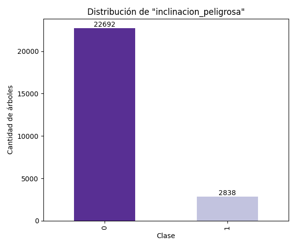
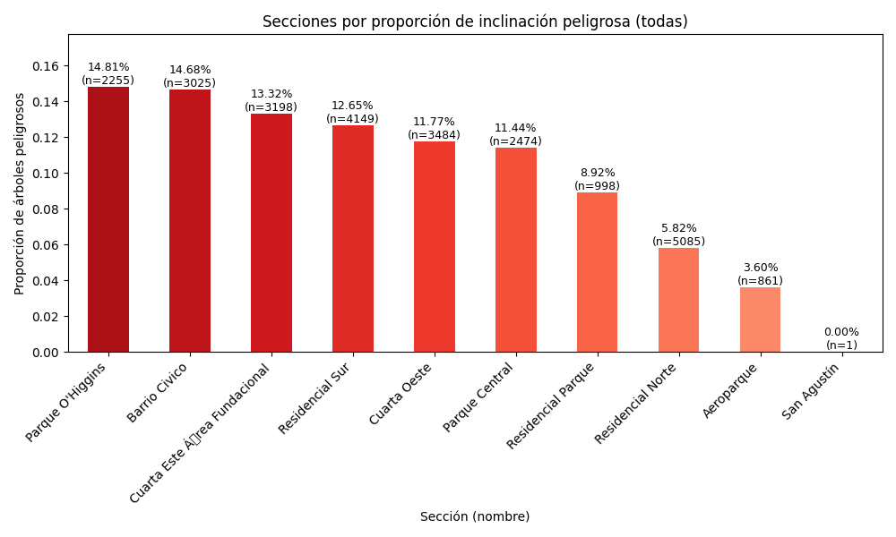
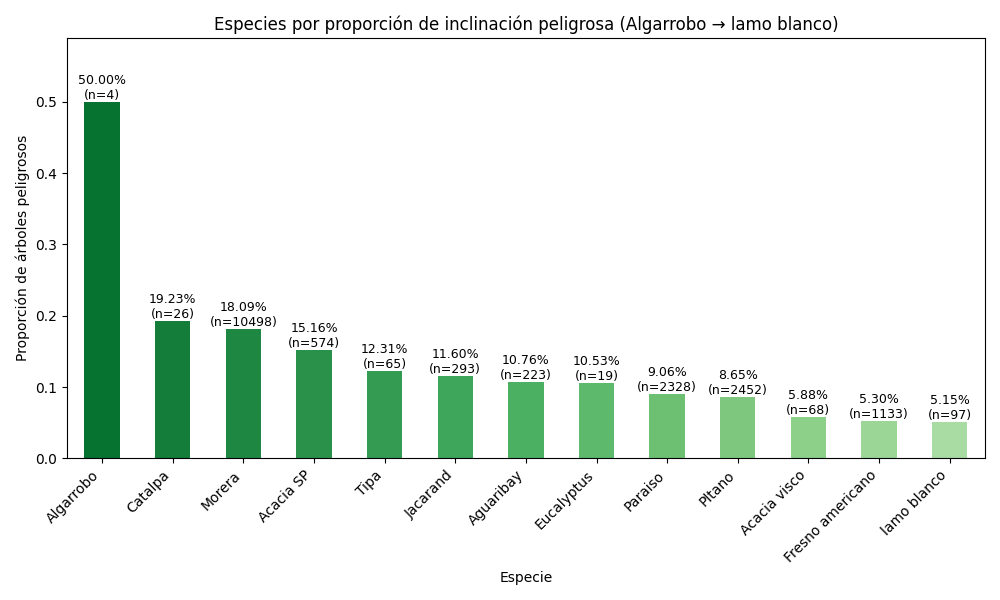
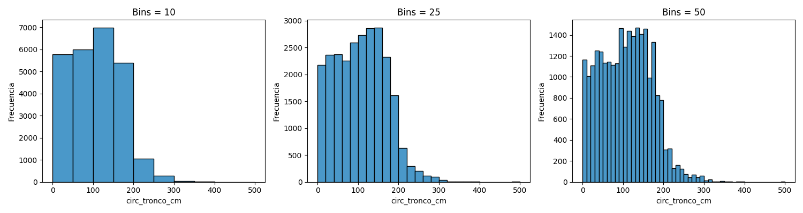
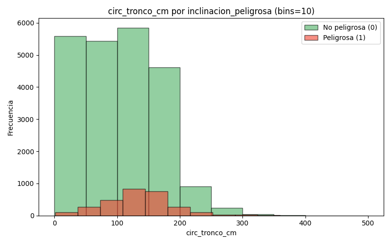
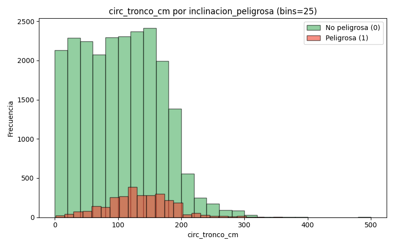
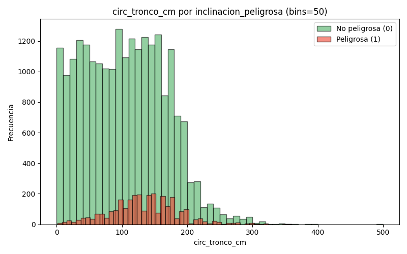

# TP7B — EDA

---

## 2) Análisis exploratorio de datos

## a) ¿Cuál es la distribución de la clase `inclinacion_peligrosa`?

Visualización:

- La clase `0` (no peligrosa) es claramente mayoritaria: 22.692 árboles (≈ 88.88%).
- La clase `1` (peligrosa) corresponde a 2.838 árboles (≈ 11.12%).

La mayoría de los árboles en el conjunto de entrenamiento no fueron marcados como de inclinación peligrosa. Sin embargo, ~11% es una fracción relevante que merece análisis por sección y por especie.

---

## b) ¿Se puede considerar alguna sección más peligrosa que otra?

Visualización (todas las secciones):

- Sí. Algunas secciones muestran una proporción de árboles peligrosos claramente mayor que la media. Las 5 secciones con mayor proporción en el conjunto de entrenamiento son (proporción de árboles peligrosos):

  1. Parque O'Higgins — 14.81% (n=2255)
  2. Barrio Civico — 14.68% (n=3025)
  3. Cuarta Este Área Fundacional — 13.32% (n=3198)
  4. Residencial Sur — 12.65% (n=4149)
  5. Cuarta Oeste — 11.77% (n=3484)

Aunque la proporción global de árboles peligrosos es ~11%, en algunas secciones céntricas o de parques la proporción supera el 12–14%, por lo que se las puede considerar secciones relativamente más peligrosas y priorizables para inspección o mantenimiento.

---

## c) ¿Se puede considerar alguna especie más peligrosa que otra?

Visualización (subsecuencia de especies):

Respuesta breve:

- Sí. Hay especies con proporciones de inclinación peligrosa mucho más altas que la mayoría. Top especies por proporción de riesgo:

  1. Algarrobo — 50.00% (n=4)
  2. Catalpa — 19.23% (n=26)
  3. Morera — 18.09% (n=10498)
  4. Acacia SP — 15.16% (n=574)
  5. Tipa — 12.31% (n=65)

Especies con pocos ejemplares (p. ej. Algarrobo, n=4) pueden mostrar porcentajes extremos por tamaño de muestra pequeño, para decisiones de gestión conviene priorizar especies con amplio número de ejemplares y alta proporción (por ejemplo, Morera muestra riesgo alto con n grande). Esto sugiere priorizar inspección de ciertas especies muy comunes y con proporciones elevadas.

---

## 3) Histogramas de `circ_tronco_cm`

### a) Histogramas con distintos números de bins

Visualización (comparación de bins 10, 25, 50):

### b) Histogramas por clase `inclinacion_peligrosa`

Visualizaciones (bins 10, 25, 50 — comparación clase 0 vs 1):

## c) Criterios de corte usados en el ejercicio (3)

Se generaron los histogramas de la variable `circ_tronco_cm` (comparación entre distintos números de bins y comparación por la clase `inclinacion_peligrosa`). A partir de la distribución observada en los histogramas se definieron cortes basados en los cuartiles para construir la variable categórica `circ_tronco_cm_cat` con cuatro niveles ordenados.

Puntos de corte (cuartiles) calculados sobre el conjunto de entrenamiento:

- Q1 (25%) = 58.0 cm
- Q2 (50%) = 110.0 cm
- Q3 (75%) = 156.0 cm

Categorías definidas (etiquetas y orden):

- `bajo`      : circ_tronco_cm <= Q1
- `medio`     : Q1 < circ_tronco_cm <= Q2
- `alto`      : Q2 < circ_tronco_cm <= Q3
- `muy alto`  : circ_tronco_cm > Q3

